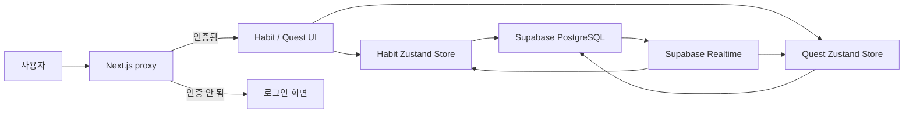

# Habit Quest

> 매일의 습관을 경험치로 바꾸는 8-bit 습관 관리 서비스

Habit Quest는 반복해야 할 일을 퀘스트처럼 등록하고, 완료한 만큼 캐릭터를 성장시키는 웹 애플리케이션이다.

체크박스를 채우는 데서 끝내지 않는다. 습관을 완료하면 경험치를 얻고, 기준 경험치를 채우면 레벨이 오른다. 습관 기록과 캐릭터 상태는 Supabase에 저장되며, 같은 계정으로 열린 화면에는 변경 사항이 실시간으로 반영된다.

```text
습관 등록 → 오늘의 퀘스트 완료 → 경험치 획득 → 레벨 업
```

## 현재 구현된 기능

### 계정과 접근 제어

- 이메일과 비밀번호를 사용한 회원가입·로그인
- Supabase Auth 세션을 기준으로 사용자 식별
- 로그인 사용자의 `/login` 접근과 비로그인 사용자의 `/` 접근을 `proxy.ts`에서 차단
- 사용자별 습관과 성장 데이터 분리

### 습관 관리

- 습관 등록과 삭제
- 건강, 학습, 취미, 루틴, 기타 카테고리 분류
- 완료 상태 토글
- 완료 시 경험치 획득, 완료 취소 시 획득 경험치 회수
- Supabase Realtime을 이용한 `INSERT`, `UPDATE`, `DELETE` 실시간 반영

### 성장 시스템

- 현재 레벨, 경험치, 다음 레벨 요구 경험치 표시
- 습관 하나를 완료할 때마다 기본 경험치 10 획득
- 최초 요구 경험치 100, 레벨이 오를 때마다 다음 요구 경험치 50 증가
- 레벨 업 모달과 8-bit Confetti 연출
- 캐릭터 성장 상태 초기화

### 관리자 화면 프로토타입

- `/admin`에 KPI 카드, 요일별 달성률 차트, 사용자 활동 테이블 구성
- 현재 관리자 화면은 실제 데이터나 권한 체계와 연결되지 않은 정적 UI 프로토타입

## 동작 구조



화면 컴포넌트는 Supabase를 직접 조작하지 않고 Zustand 스토어의 액션을 호출한다. 스토어는 인증 사용자 확인, 데이터 조회·변경, 에러 상태를 맡는다. 데이터베이스에서 발생한 변경은 사용자 ID로 필터링된 Realtime 채널을 통해 다시 스토어에 들어오며 UI가 갱신된다.

## 기술 스택

| 영역 | 기술 | 역할 |
| --- | --- | --- |
| 프레임워크 | Next.js 16 App Router | 라우팅, 서버 측 접근 제어, 애플리케이션 구성 |
| UI | React 19, TypeScript | 컴포넌트와 타입 기반 UI 구현 |
| 스타일 | Tailwind CSS 4 | 8-bit 디자인 토큰과 반응형 레이아웃 |
| 상태 관리 | Zustand 5 | 습관·성장 상태와 비동기 액션 관리 |
| 인증·데이터 | Supabase Auth, PostgreSQL, Realtime | 사용자 인증, 영속화, 실시간 동기화 |
| 애니메이션 | Framer Motion | 레벨 업 모달과 픽셀 파티클 연출 |
| 데이터 시각화 | Recharts | 관리자 화면 차트 프로토타입 |
| UI 기반 | Radix UI, CVA | 조합 가능한 버튼과 공통 UI 변형 |

## 핵심 설계

### 기능 단위 디렉터리

파일 종류만으로 코드를 나누지 않고 `habit`, `quest`, `login`이라는 기능을 기준으로 타입·스토어·컴포넌트를 묶었다.

```text
features/
├── habit/
│   ├── components/
│   ├── store.ts
│   └── types.ts
├── login/
│   └── components/
└── quest/
    ├── components/
    ├── store.ts
    └── types.ts
```

기능을 수정할 때 관련 파일을 한 영역에서 추적할 수 있고, 공통 UI와 도메인 코드를 섞지 않는다.

### Supabase를 선택한 이유

사용자와 습관은 1:N 관계를 이루고, 경험치와 레벨은 정합성이 중요한 데이터다. 문서 구조가 자유로운 Firebase보다 PostgreSQL 기반의 명시적인 스키마와 향후 통계 쿼리에 유리한 Supabase를 선택했다.

Supabase CLI로 생성한 `database.types.ts`를 브라우저 클라이언트에 주입해 테이블 컬럼과 요청 데이터의 타입을 컴파일 단계에서 확인한다. 선택 과정은 [ADR 0001](./docs/adr/001-database-selection.md)에 기록했다.

### 인증을 화면보다 먼저 검사

보호된 화면이 잠깐 노출된 뒤 로그인 페이지로 이동하는 흐름을 피하기 위해, 클라이언트 컴포넌트가 아니라 Next.js 16의 `proxy.ts`에서 세션을 확인한다.

```text
비로그인 사용자 + / 요청  → /login
로그인 사용자 + /login 요청 → /
```

### 실시간 구독의 생명주기 관리

습관과 프로필 채널은 로그인한 사용자의 ID로 필터링한다. 컴포넌트가 마운트될 때 구독을 시작하고 언마운트될 때 채널을 제거해 중복 구독과 메모리 누수를 막는다.

```text
mount → 최초 데이터 조회 → 사용자별 Realtime 구독 → 변경 반영
unmount → Realtime 채널 제거
```

### 반복 가능한 애니메이션 트리거

Confetti 실행 여부를 `boolean`으로 관리하면 애니메이션 도중 다시 완료했을 때 `true → true`가 되어 새 렌더링이 발생하지 않는다. 실행할 때마다 값이 달라지는 숫자 카운터를 트리거로 사용해 연속 완료도 별개의 이벤트로 처리한다.

```text
0 → 1 → 2 → 3 ...
```

## 데이터 모델

### `habits`

| 컬럼 | 설명 |
| --- | --- |
| `id` | 습관 ID |
| `user_id` | 습관 소유 사용자 ID |
| `title`, `description` | 습관 이름과 설명 |
| `category` | 습관 카테고리 |
| `is_completed` | 현재 완료 상태 |
| `streak` | 연속 달성 일수 |
| `exp_reward` | 완료 보상 경험치 |
| `created_at` | 생성 시각 |

### `profiles`

| 컬럼 | 설명 |
| --- | --- |
| `id` | Supabase Auth 사용자와 연결되는 ID |
| `level` | 현재 레벨 |
| `current_exp` | 현재 경험치 |
| `next_exp` | 다음 레벨 요구 경험치 |
| `updated_at` | 갱신 시각 |

## 프로젝트 구조

```text
habit-quest/
├── app/
│   ├── admin/             # 관리자 대시보드 UI 프로토타입
│   ├── login/             # 로그인 페이지
│   ├── globals.css        # 전역 스타일과 레트로 디자인 토큰
│   ├── layout.tsx
│   └── page.tsx           # 습관·성장 메인 화면
├── components/ui/         # 공통 Button, Card, Table
├── docs/
│   ├── adr/               # 기술 선택 기록
│   └── day*-learning-notes.md
├── features/
│   ├── habit/             # 습관 도메인
│   ├── login/             # 인증 UI
│   └── quest/             # 경험치·레벨 도메인
├── lib/
│   ├── supabase/          # 타입이 적용된 Supabase 클라이언트
│   └── utils.ts
└── proxy.ts               # 인증 기반 라우트 가드
```

## 로컬 실행

### 요구 환경

- Node.js 20.9 이상
- npm
- Supabase 프로젝트

### 설치

```bash
git clone https://github.com/Burgerjoa/habit-quest.git
cd habit-quest
npm ci
```

### 환경 변수

프로젝트 루트에 `.env.local`을 만들고 Supabase 프로젝트 값을 입력한다.

```env
NEXT_PUBLIC_SUPABASE_URL=your_supabase_project_url
NEXT_PUBLIC_SUPABASE_ANON_KEY=your_supabase_anon_key
```

애플리케이션은 위 데이터 모델과 사용자별 Row Level Security 정책, `habits`·`profiles` 테이블의 Realtime 설정이 적용된 Supabase 프로젝트를 전제로 한다.

### 개발 서버

```bash
npm run dev
```

브라우저에서 [http://localhost:3000](http://localhost:3000)을 연다.

### 검사와 프로덕션 빌드

```bash
npm run lint
npm run build
npm run start
```

## 구현 기록

- [Supabase 선택: ADR 0001](./docs/adr/001-database-selection.md)
- [인증, DB 타입 동기화, Route Guard](./docs/day2-learning-notes.md)
- [Zustand 비동기 상태와 Supabase Realtime](./docs/day3-learning-notes.md)
- [Framer Motion과 반복 애니메이션 트리거](./docs/day4-learning-notes.md)

## 현재 한계

- `streak` 필드는 존재하지만 날짜별 달성 기록과 연속 달성 계산은 아직 구현되지 않았다.
- 습관은 현재 생성·완료·삭제만 가능하며 수정, 반복 주기, 알림 기능은 없다.
- 경험치 계산과 프로필 갱신이 클라이언트에서 순차 실행되므로 원자적 트랜잭션이 아니다.
- `/admin`은 정적 데이터로 만든 UI 프로토타입이며 관리자 인증과 실제 통계 조회가 연결되지 않았다.
- Supabase 스키마와 RLS 정책은 아직 마이그레이션 파일로 버전 관리되지 않는다.
- 자동화 테스트는 아직 구성되지 않았다.

## 다음 단계

- 날짜별 습관 완료 기록과 연속 달성 계산
- 경험치 지급을 데이터베이스 함수로 옮겨 원자성 보장
- 관리자 권한과 실제 통계 쿼리 연결
- Supabase 마이그레이션과 로컬 개발 환경 구성
- 스토어·컴포넌트 단위 테스트와 핵심 사용자 흐름 E2E 테스트
- 배포 환경과 서비스 미리보기 추가
